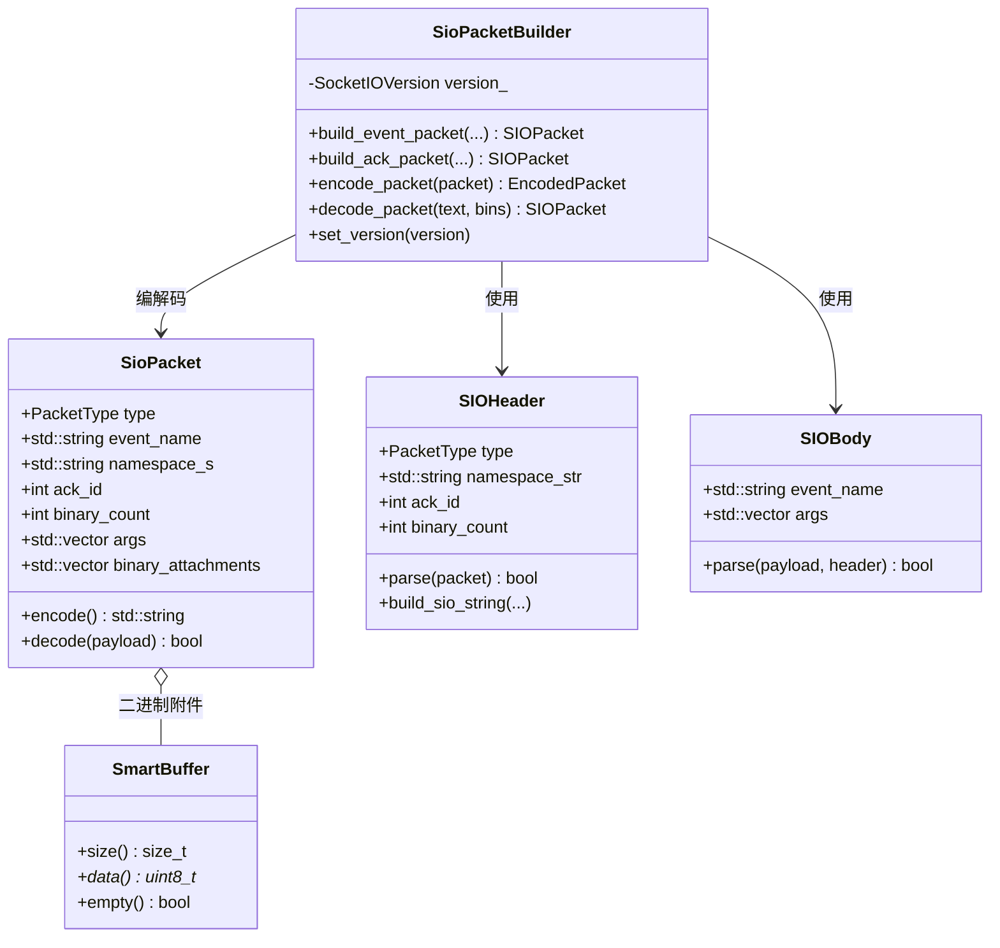
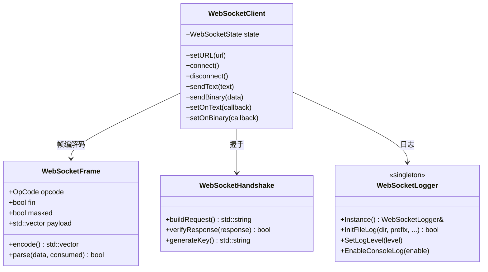
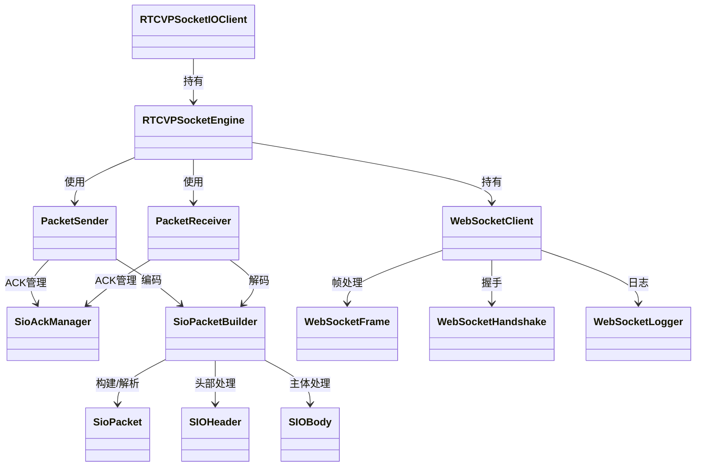

# LYMVPSocketIO

基于 WebRTC 底层组件构建的高性能 Socket.IO 客户端库，支持 V2/V3/V4 协议。

## 目录

- [特性](#特性)
- [架构概览](#架构概览)
- [类图](#类图)
- [快速开始](#快速开始)
- [Mac Demo](#mac-demo)
- [测试](#测试)
- [WebRTC 组件使用清单](#webrtc-组件使用清单)
- [目录结构](#目录结构)

## 特性

- ✅ Socket.IO V2 / V3 / V4 协议支持
- ✅ 事件收发与 ACK 确认机制
- ✅ 二进制数据传输（BINARY_EVENT / BINARY_ACK）
- ✅ 命名空间（Namespace）支持
- ✅ 房间（Room）功能
- ✅ 自动重连（可选）
- ✅ 基于 WebRTC TaskQueue 的异步架构
- ✅ 基于 WebRTC FileRotatingLogSink 的文件日志
- ✅ 跨平台 WebSocket 实现（C++ + libevent）
- ✅ macOS / iOS Objective-C 封装

## 架构概览

```
┌─────────────────────────────────────────────────────────┐
│                Objective-C 层 (macOS/iOS)                │
│  RTCVPSocketIOClient  ──  RTCVPSocketEngine              │
│  RTCVPSocketIOConfig   ──  RTCVPTimeoutManager           │
└───────────────────────────┬─────────────────────────────┘
                            │
┌───────────────────────────▼─────────────────────────────┐
│                      C++ 核心层                          │
│  ┌──────────────┐    ┌──────────────┐                   │
│  │ SioPacket    │    │SioPacketBldr │  协议编解码       │
│  └──────┬───────┘    └──────┬───────┘                   │
│         │                   │                           │
│  ┌──────▼───────┐    ┌──────▼───────┐                   │
│  │ PacketSender │    │PacketReceiver│  发送/接收        │
│  └──────┬───────┘    └──────┬───────┘                   │
│         │                   │                           │
│  ┌──────▼───────────────────▼───────┐                   │
│  │         SioAckManager            │  ACK 管理         │
│  └──────────────────────────────────┘                   │
│                                                          │
│  ┌──────────────────────────────────┐                   │
│  │         WebSocketClient          │  WebSocket 层     │
│  └───────────────┬──────────────────┘                   │
└──────────────────┼──────────────────────────────────────┘
                   │
┌──────────────────▼──────────────────────────────────────┐
│                    WebRTC 基础设施                       │
│  TaskQueue / RepeatingTask / Mutex / Logging / Buffer   │
└──────────────────────────────────────────────────────────┘
```

## 类图

### 核心协议层



### ACK 管理层

```mermaid
classDiagram
    class IAckManager {
        <<interface>>
        +generate_ack_id() int
        +register_ack_callback(...) bool
        +handle_ack_response(...) bool
        +clear()
    }

    class SioAckManager {
        -std::unordered_map<int, AckInfo> pending_acks_
        -std::atomic<uint64_t> next_ack_id_
        -std::shared_ptr<rtc::TaskQueue> task_queue_
        -webrtc::RepeatingTaskHandle timeout_checker_handle_
        -webrtc::Mutex mutex_
        +Create(...) shared_ptr<SioAckManager>
        +start()
        +stop()
        +check_timeouts()
    }

    class AckInfo {
        +AckCallback callback
        +AckTimeoutCallback timeout_callback
        +std::chrono::steady_clock::time_point send_time
        +std::chrono::milliseconds timeout
        +bool processed
    }

    IAckManager <|.. SioAckManager
    SioAckManager o-- AckInfo : 管理
    SioAckManager --> rtc::TaskQueue : 使用
    SioAckManager --> webrtc::RepeatingTaskHandle : 超时检查
```

### 发送/接收层

```mermaid
classDiagram
    class PacketSender {
        -std::shared_ptr<IAckManager> ack_manager_
        -std::shared_ptr<rtc::TaskQueue> task_queue_
        -webrtc::RepeatingTaskHandle cleanup_handle_
        +emit(event, args, send_cb)
        +emit(event, args, send_cb, ack_cb)
        +emit(event, args, send_cb, ack_cb, timeout_cb, timeout)
        +send_event(...)
        +send_event_with_ack(...)
        +send_ack_response(...)
    }

    class PacketReceiver {
        -std::shared_ptr<IAckManager> ack_manager_
        -std::unique_ptr<SioPacketBuilder> packet_builder_
        -std::shared_ptr<rtc::TaskQueue> task_queue_
        -std::unordered_map<string, EventHandler> event_handlers_
        +on(event, handler)
        +off(event)
        +remove_all_listeners()
        +set_send_callback(cb)
        +process_text_message(...)
        +process_binary_message(...)
        +set_event_callback(...)
    }

    PacketSender --> IAckManager : 使用
    PacketReceiver --> IAckManager : 使用
    PacketReceiver --> SioPacketBuilder : 使用
    PacketSender --> webrtc::RepeatingTaskHandle : 清理定时器
```

### WebSocket 层



### 整体关系



## 快速开始

### 推荐：简洁 API（Socket.IO 风格）

```cpp
#include "sio_packet_impl.h"
#include "sio_ack_manager.h"
#include "websocket/websocket_logger.h"

using namespace sio;

// 1. 初始化日志
ws::WebSocketLogger::Instance().InitFileLog("./logs", "socketio", 10*1024*1024, 5);

// 2. 创建 ACK 管理器 + 发送器 + 接收器
auto ack_manager = SioAckManager::Create();
auto sender = std::make_shared<PacketSender>(ack_manager);
auto receiver = std::make_shared<PacketReceiver>(ack_manager);

// 3. 注册事件处理（服务端/接收端）
receiver->on("echo", [](const std::vector<Json::Value>& args, AckResponder ack) {
    // 收到事件，直接回 ACK
    ack({Json::Value("got it"), args[0]});
});

// 4. 设置发送回调（把数据发到 WebSocket）
receiver->set_send_callback([&](const std::string& text, const std::vector<SmartBuffer>& bins) -> bool {
    // 实际使用时：client.sendText(text);
    return true;
});

// 5. 发送带 ACK 的事件（客户端/发送端），一行搞定
sender->emit("echo",
    {Json::Value("hello"), Json::Value(42)},
    [&](const std::string& text, const std::vector<SmartBuffer>& bins) -> bool {
        // 实际使用时：client.sendText(text);
        return true;
    },
    [](const std::vector<Json::Value>& ack_data) {
        // ACK 响应回调
        RTC_LOG(LS_INFO) << "收到 ACK: " << ack_data[0].asString();
    });
```

**emit 重载版本：**

```cpp
// 无 ACK
sender->emit("event", {arg1, arg2}, send_callback);

// 带 ACK 回调
sender->emit("event", {arg1, arg2}, send_callback,
    [](const std::vector<Json::Value>& data) { /* ACK */ });

// 带 ACK + 超时 + 超时回调
sender->emit("event", {arg1, arg2}, send_callback,
    [](const std::vector<Json::Value>& data) { /* ACK */ },
    [](int ack_id) { /* 超时 */ },
    std::chrono::seconds(5));
```

**on / off 事件管理：**

```cpp
// 注册事件
receiver->on("chat message", [](const auto& args, auto ack) { ... });

// 移除事件
receiver->off("chat message");

// 移除所有
receiver->remove_all_listeners();
```

### 底层 API（直接控制）

```cpp
#include "sio_packet_builder.h"
#include "sio_ack_manager.h"
#include "websocket/websocket_client.h"
#include "websocket/websocket_logger.h"

// 1. 初始化文件日志
ws::WebSocketLogger::Instance().InitFileLog("./logs", "socketio", 10*1024*1024, 5);
ws::WebSocketLogger::Instance().SetLogLevel(ws::LogLevel::Info);

// 2. 创建 ACK 管理器
auto ack_manager = sio::SioAckManager::Create();

// 3. 创建 WebSocket 客户端
ws::WebSocketClient client;
client.setURL("ws://localhost:3000/socket.io/?EIO=3&transport=websocket");
client.connect();

// 4. 发送带 ACK 的消息
sio::SioPacketBuilder builder(sio::SocketIOVersion::V3);
int ack_id = ack_manager->generate_ack_id();

auto packet = builder.build_event_packet("hello", {Json::Value("world")}, "/", ack_id);
auto encoded = builder.encode_packet(packet);

ack_manager->register_ack_callback(ack_id,
    [](const std::vector<Json::Value>& data) {
        // ACK 响应
    },
    std::chrono::seconds(5),
    [](int ack_id) {
        // 超时回调
    });

client.sendText(encoded.text_packet);
```

### HTTPS / WSS 自签名证书配置

在开发或测试环境中，经常需要使用自签名证书的 HTTPS 服务器。以下是不同层级的配置方式：

**C++ WebSocket 层：**

```cpp
#include "websocket/websocket_client.h"

ws::WebSocketClient client;
client.setURL("wss://localhost:3004/socket.io/?EIO=4&transport=websocket");

// 启用自签名证书支持（跳过证书验证，仅用于开发/测试环境）
client.setSelfSignedSSL(true);

client.connect();
```

> ⚠️ **安全提示**：`setSelfSignedSSL(true)` 会跳过证书验证，仅建议在开发/测试环境使用。生产环境请使用正规 CA 签发的证书。

**Objective-C 层：**

```objc
#import "RTCCPPCWebSocket.h"

// C++ WebSocket 模式下直接设置
RTCCPPCWebSocket *ws = [[RTCCPPCWebSocket alloc] init];
ws.selfSignedSSL = YES;
```

**生成自签名证书（测试用）：**

```bash
# 使用 openssl 生成自签名证书
openssl req -x509 -newkey rsa:2048 -keyout key.pem -out cert.pem \
    -days 365 -nodes -subj "/CN=localhost"
```

### Objective-C 使用

```objc
#import "RTCVPSocketIOClient.h"
#import "RTCVPSocketIOConfig.h"

RTCVPSocketIOConfig *config = [RTCVPSocketIOConfig defaultConfig];
config.protocolVersion = RTCVPSocketIOProtocolVersion3;
config.loggingEnabled = YES;

RTCVPSocketIOClient *client = [[RTCVPSocketIOClient alloc]
    initWithSocketURL:[NSURL URLWithString:@"http://localhost:3000"]
               config:config];

[client on:@"connect" callback:^(NSArray *data, RTCVPSocketAckEmitter *ack) {
    NSLog(@"连接成功");
}];

[client connect];
```

## Mac Demo

项目包含一个 Mac 命令行 Demo，可直接运行测试。

### 编译运行

```bash
cd LYMVPSocketIO/LYMVPSocketIO
mkdir -p build && cd build
cmake ..
make socketio_demo -j$(sysctl -n hw.ncpu)
./test/socketio_demo
```

### 功能菜单

```
=== 菜单 ===
1. 连接 V2 服务器 (localhost:3002)
2. 连接 V3 服务器 (localhost:3003)
3. 发送文本消息
4. 发送二进制消息
5. 发送带 ACK 的消息
6. 加入房间
7. 发送房间消息
8. 断开连接
9. 退出
```

## 测试

### 单元测试 & 集成测试

```bash
cd build

# Socket.IO 协议全量 + 边界测试（90个用例）
make test_socketio_full
./test/test_socketio_full

# WebSocket + Socket.IO 集成测试（含全双工ACK、压力测试）
make test_websocket_integration
./test/test_websocket_integration

# 协议层全量测试
make test_protocol_full
./test/test_protocol_full

# WebSocket 单元测试
make test_websocket_unit
./test/test_websocket_unit
```

### 测试报告 & 日志

运行 `test_socketio_full` 会自动生成：
- `test_reports/test_report.md` - Markdown 格式测试报告
- `test_logs/socketio_test_0` - 详细日志文件（WebRTC FileRotatingLogSink）

## WebRTC 组件使用清单

项目深度使用 WebRTC 基础组件，避免重复造轮子：

| 分类 | WebRTC 组件 | 用途 | 原替代方案 |
|------|------------|------|-----------|
| **同步原语** | `webrtc::Mutex` | 互斥锁 | `std::mutex` |
| | `webrtc::MutexLock` | 作用域锁 | `std::lock_guard` |
| **任务调度** | `rtc::TaskQueue` | 异步任务队列 | `std::thread` + 队列 |
| | `webrtc::TaskQueueFactory` | TaskQueue 工厂 | - |
| **定时器** | `webrtc::RepeatingTaskHandle` | 重复任务/超时检查 | 自定义定时器 |
| | `webrtc::TimeDelta` | 时间差类型 | `std::chrono::milliseconds` |
| **日志** | `rtc::FileRotatingLogSink` | 文件日志轮转 | 自定义实现 |
| | `RTC_LOG(LS_*)` | 日志宏 | `printf` / `NSLog` |
| **字符串** | `rtc::StringBuilder` | 字符串构建 | `std::stringstream` |
| | `rtc::Base64` | Base64 编解码 | 自定义实现 |
| | `rtc::string_trim` | 字符串修剪 | 自定义实现 |
| **缓冲区** | `rtc::Buffer` | 二进制缓冲区 | `std::vector<uint8_t>` |
| **内存** | `absl::make_unique` | 智能指针 | `std::make_unique` |
| | `webrtc::scoped_refptr` | 引用计数指针 | 手动 retain/release |
| **线程** | `rtc::Thread` | 跨平台线程 | `std::thread` |
| **定位** | `LOCATION_HERE` / `RTC_FROM_HERE` | 代码位置宏 | `__FILE__`/`__LINE__` |

> **说明**：WebSocket 底层的 ping 定时器使用 libevent（因为事件循环本身基于 libevent），业务层定时器统一使用 WebRTC RepeatingTask。

## 目录结构

```
LYMVPSocketIO/LYMVPSocketIO/
├── lib/                          # C++ 核心库
│   ├── sio_packet.h/.cpp         # Socket.IO 数据包
│   ├── sio_packet_builder.h/.cpp # 数据包构建器
│   ├── sio_packet_impl.h/.cc     # 发送/接收实现
│   ├── sio_ack_manager.h/.cpp    # ACK 管理器
│   ├── sio_ack_manager_interface.h # ACK 接口
│   ├── sio_packet_types.h        # 类型定义
│   ├── sio_smart_buffer.hpp      # 智能缓冲区
│   ├── sio_jsoncpp_binary_helper.hpp # JSON二进制辅助
│   ├── sio_packet_printer.hpp    # 数据包调试打印
│   ├── websocket/                # WebSocket 实现
│   │   ├── websocket_client.h/.cpp
│   │   ├── websocket_frame.h/.cpp
│   │   ├── websocket_handshake.h/.cpp
│   │   └── websocket_logger.h/.cpp
│   └── test/                     # 测试
│       ├── test_socketio_full.cpp
│       ├── test_protocol_full.cpp
│       └── test_websocket_integration.cpp
├── src/                          # Objective-C 封装
│   ├── RTCVPSocketIOClient.h/.mm
│   ├── RTCVPSocketEngine.h/.m
│   ├── RTCVPSocketIOConfig.h/.m
│   └── utils/                    # 工具类
├── Category/                     # 分类
├── jetfire/                      # Jetfire WebSocket (备用)
├── third_party/                  # 第三方依赖
│   ├── libWebRTC/                # WebRTC 库
│   └── jsoncpp/                  # JSON 库
└── CMakeLists.txt                # CMake 构建配置
```

## License

MIT
